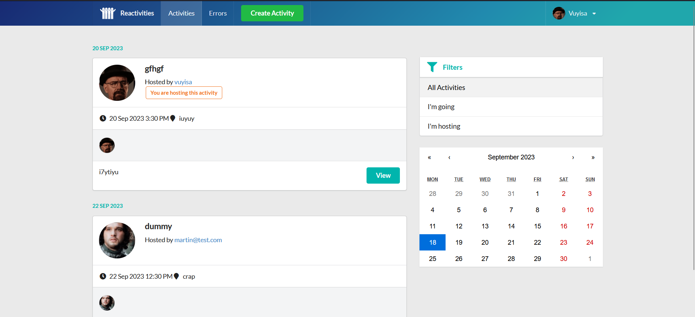

# Reactivities

Welcome to **reactivities**! This app is a culmination of everything I've learned in React and ASP.NET Core, designed for creating and managing activities. With added flair of chat and social media functionalities, this is where event planning meets fun and engagement.

## 🚀 Getting Started

Follow these steps to get the app up and running:

### Prerequisites

- .NET Core SDK
- Node.js

### Instructions

1. **Clone the Repo**  
   git clone https://github.com/Vuyisab/Baza-Reactivity.git

2. **Navigate into the Main Folder**  
   cd Reactivity

3. **Fire Up the Backend**
   dotnet run --project API

4. **Start the Frontend**  
   Open a new terminal tab or window.
   cd client-app
   npm i # This installs necessary packages
   npm start # This starts the frontend

5. **Access the App**  
   Your browser should automatically open up and take you to the app. If not, no worries! Just head on over to: http://localhost:3000

6. **Dive In!**  
   Enjoy exploring reactivities! 🎉
